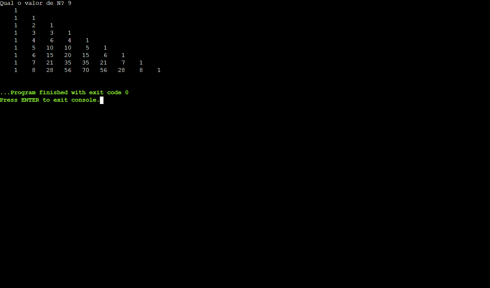

<h1 align="center"> Projeto C - Triângulo de Pascal </h1>

Projeto em Linguagem C durante o curso Análise e Desenvolvimento de Sistemas pela Fatec Ipiranga.

---

 

  

---
## 💻 Tecnologias

Esse projeto foi desenvolvido com as seguintes tecnologias:

- Linguagem C
- Git e Github

---

## 🚧 Projeto

O programa pergunta ao usuário qual o tamanho que ele quer que seja o Triângulo de Pascal, calculando através de loops de repetição.

Mais Informações sobre o Teorema do Triângulo de Pascal: https://www.todamateria.com.br/triangulo-de-pascal/

Você pode ver o Projeto e Testar neste link: [Batalha Naval - C](https://onlinegdb.com/0QFhEr_WQ)

--- 
